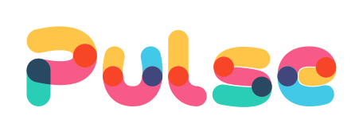

# 

## What is Pulse?

Pulse is a game engine in the **very** early stages of development (it's pretty empty here right now).

## License

Pulse is free and open source! All code in this repository is licensed under the MIT License (LICENSE or http://opensource.org/licenses/MIT).

The [assets](assets) in this repository are acquired from multiple sources and will have their own license.
